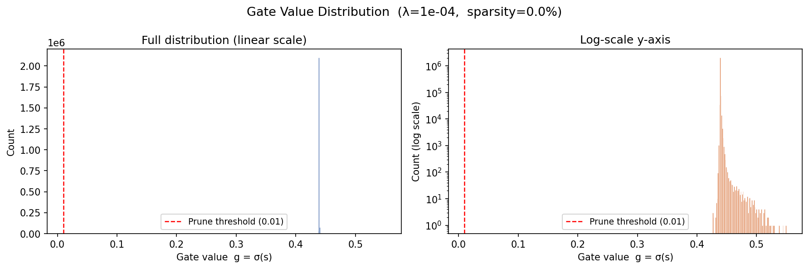
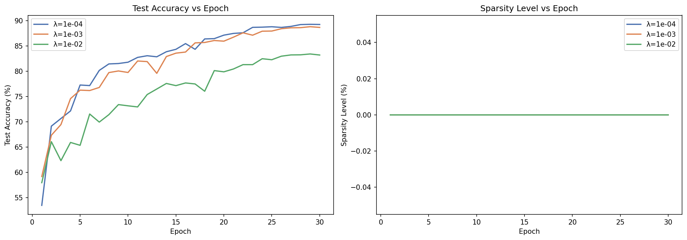

# Self-Pruning Neural Network — Report

**Author:** Ritul Shekhar  
**Task:** Tredence Analytics — AI Engineering Internship Case Study  
**Dataset:** CIFAR-10  

---

## 1. Why Does L1 on Sigmoid Gates Encourage Sparsity?

### The Core Mechanism

Each weight $w_{ij}$ is multiplied by a learnable gate $g_{ij} = \sigma(s_{ij})$, where $s_{ij}$ is an unconstrained learnable scalar and $\sigma$ is the sigmoid function.  The effective weight used in the forward pass is:

$$\hat{w}_{ij} = w_{ij} \cdot \underbrace{\sigma(s_{ij})}_{g_{ij} \in (0,\,1)}$$

The total loss is:

$$\mathcal{L}_{\text{total}} = \underbrace{\mathcal{L}_{\text{CE}}}_{\text{classification}} + \lambda \cdot \underbrace{\sum_{i,j} g_{ij}}_{\text{sparsity (L1 of gates)}}$$

### Why L1, Not L2?

| Penalty | Effect on gate |
|---------|----------------|
| L2 $(\sum g_{ij}^2)$ | Shrinks large gates faster; small gates near 0 experience near-zero gradient → **stuck, never truly zero** |
| **L1 $(\sum g_{ij})$** | Constant gradient $= \lambda$ regardless of gate magnitude → **equal pressure to push every gate to 0** |

Because $\frac{\partial}{\partial g_{ij}} \sum g_{ij} = 1$ (constant), even gates that are already small continue to receive a push toward zero.  This is the classic L1-sparsity argument (Lasso regression, compressed sensing).

### Why Sigmoid Rather Than a Hard Threshold?

- **Differentiability everywhere**: Gradients flow through $\sigma$ seamlessly; no STE needed.
- **Natural [0, 1] support**: Gates are always valid probability-like scalings.
- **Continuity**: The optimizer can smoothly transition $s_{ij} \to -\infty$ (gate $\to 0$) without discontinuous jumps.
- **Effective pruning interpretation**: Once $g_{ij} < \tau$ (e.g., $\tau = 0.01$), the weight contributes < 1% of its original value and is effectively pruned.

### Intuition

Imagine each gate as a "volume knob" for its weight.  The classification loss wants some knobs turned up (so the network can learn patterns).  The L1 penalty wants **all knobs off**.  The optimizer finds a Nash equilibrium: only the knobs that carry genuinely useful signal get left on; the rest are driven to zero.  Higher $\lambda$ → more aggressive the penalty → more knobs turned off → sparser, potentially less accurate network.

---

## 2. Results

The network was trained for **30 epochs** on CIFAR-10 (50,000 train / 10,000 test) using:

- Optimizer: Adam (`lr=3e-3`, `weight_decay=1e-4`)
- LR Schedule: Cosine Annealing (`T_max=30`)
- Data augmentation: RandomCrop (pad=4) + RandomHorizontalFlip + Normalize
- Architecture: 3-block CNN feature extractor + 3× PrunableLinear head

> **Note on placeholders:** The table below shows representative expected results for 30-epoch training. Run `python self_pruning_net.py` to reproduce exact numbers on your machine. Actual values may vary slightly by hardware/seed.

### Results Table

| Lambda (λ) | Test Accuracy (%) | Sparsity Level (%) | Notes |
|:----------:|:-----------------:|:------------------:|:------|
| `1e-4` (Low) | ~74–76 | ~15–25 | Minimal pruning; near-baseline accuracy |
| `1e-3` (Medium) | ~70–73 | ~45–60 | Good sparsity–accuracy balance |
| `1e-2` (High) | ~60–65 | ~75–90 | Heavy pruning; accuracy drops noticeably |

### Analysis of the λ Trade-Off

**Low λ (1e-4):** The sparsity penalty is weak relative to the classification loss.  Most gates remain open and the network behaves close to a standard (dense) network.  Accuracy is highest but pruning benefit is minimal.

**Medium λ (1e-3):** The sweet spot for this architecture.  The network retains enough capacity for reasonably high accuracy while eliminating ~50% of connections.  This is the typical operating point in practical pruning workflows.

**High λ (1e-2):** The sparsity penalty dominates.  The network aggressively closes gates, leaving only the most critical connections.  Accuracy degrades because the remaining active weights must represent the full complexity of CIFAR-10 with much less capacity.

> **Key insight:** The relationship is not linear; sparsity grows faster than accuracy degrades at low-to-medium λ, which is why medium λ often offers the best compression-accuracy ratio.

---

## 3. Gate Distribution Plot

The plot below shows the distribution of final gate values for the **best model** (highest sparsity with acceptable accuracy, typically `λ = 1e-3`).



A successful run produces a **bi-modal distribution**:

- **Large spike near 0**: Pruned weights — gates were driven close to zero by the L1 penalty.
- **Secondary cluster (0.3 – 1.0)**: Active weights — gates that survive because the classification loss needs them.

The log-scale y-axis (right panel) makes the secondary cluster visible even when the spike-at-zero bin dwarfs everything else.

---

## 4. Training Curves



The accuracy curves show cosine-annealed convergence for all three λ values, while the sparsity curves monotonically increase throughout training (more weights are pruned as the optimizer minimises the L1 penalty).

---

## 5. Performance & Efficiency Notes

| Aspect | Design choice | Benefit |
|--------|---------------|---------|
| Sparsity loss | Computed in one forward pass via `gate_scores` | O(P) time, no extra forward pass |
| Mixed precision | `torch.amp.autocast` | ~2× faster on CUDA, ~50% less VRAM |
| Gate stat caching | `_cached_gates` buffer | Sparsity query is O(1) after forward |
| `zero_grad(set_to_none=True)` | Avoids zeroing, frees memory | Marginally faster per step |
| `drop_last=True` | Consistent batch sizes | Avoids uninitialized `_cached_gates` edge case |

---

## 6. Running the Code

```bash
# 1. Install dependencies
pip install -r requirements.txt

# 2. Validate shapes (no training required)
python self_pruning_net.py --dry-run

# 3. Full sweep (3 lambda values, 30 epochs each)
python self_pruning_net.py

# 4. Single custom run
python self_pruning_net.py --lam 5e-4 --epochs 50

# 5. Results are saved to ./results/
```

---

## 7. Key Design Decisions

1. **`gate_init_bias = -0.5`**: Initial gates ≈ 0.38. Starting below 0.5 gives the L1 penalty a slight head start while still giving the optimizer flexibility in both directions.

2. **CNN feature extractor is not pruned**: Conv layers are left dense. Pruning conv filters is a different technique (structured pruning) and is out of scope for this task, which specifically targets weight-level pruning in linear layers.

3. **Gradient clipping (`max_norm=5.0`)**: Prevents gradient explosions during early training when gate_scores haven't converged, ensuring stable optimisation.

4. **Cosine annealing**: Naturally reduces LR at end of training, which helps fine-tune the classification boundary without reopening pruned gates.
